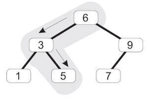
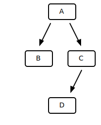

<!--
author:   Lennart Rosseburg für twillo

email:    support.twillo@tib.eu

comment:  Eine Selbstlerneinheit [...] Diese Seite ist lizenziert unter der [Lizenz CC-BY-SA (3.0)](https://creativecommons.org/licenses/by-sa/3.0/legalcode).

language: de

mode:     Textbook

version:  0.0.1

date:     19/05/2022

logo:     docs/thumbnail.JPG

icon:     docs/twillo_logo.svg

link:     https://cdn.jsdelivr.net/gh/TorroRosso46/Suchprobleme/custom.css

import:   
-->

# Dynamische Datenstrukturen

> # Lizenzhinweis
>
> Der Kurs *Dynamische Datenstrukturen*, von Lennart Rosseburg für twillo, ist lizenziert unter der [Lizenz CC-BY-SA (3.0)](https://creativecommons.org/licenses/by-sa/3.0/legalcode).
>
> #### Unter Nutzung von
>
> - Dem [Kapitel "Dynamische Datenstrukturen"](https://de.wikiversity.org/wiki/Kurs:Algorithmen_und_Datenstrukturen/Vorlesung/Dynamische_Datenstrukturen) aus dem [Kurs "Algorithmen und Datenstrukturen"](https://de.wikiversity.org/wiki/Kurs:Algorithmen_und_Datenstrukturen), von Wikiversity unter der Beteiligung folgender [Autor:innen](https://de.wikiversity.org/w/index.php?title=Kurs:Algorithmen_und_Datenstrukturen/Vorlesung/Dynamische_Datenstrukturen&action=history), unter der [Lizenz CC-BY-SA (3.0)](https://creativecommons.org/licenses/by-sa/3.0/legalcode).

<!-- style="background-color:transparent;" -->
> Diese Selbstlerneinheit konzentriert sich auf die Funktionsweise verschiedener Dynamischer Datenstrukturen und enthält interaktive Aufgaben um das Gelernte zu überprüfen und zu verinnerlichen.

<!--  style="background-color:#A6D492;" -->
> #### Ziel des Kurses:
>
> Am Ende dieser Selbstlerneinheit sollten Sie die vorgestellten Dynamischen Datenstrukturen kennen, unterscheiden und selbst anwenden können.

## Einleitung

Unter [dynamischen Datenstrukturen](https://de.wikipedia.org/wiki/Datenstruktur) verstehen wir Datenstrukturen bei denen man Elemente löschen und hinzufügen kann, eine interne Ordnung (z.B. Sortierung) vorliegt und diese Ordnung unter Änderungen aufrecht erhalten bleibt. Ein Beispiel sind Lineare Datenstrukturen und Sortierung. Bei einer **unsortierten** Liste sind Änderungen einfach, aber der Zugriff aufwändig. Bei einer **sortierten** Liste sind die Änderungen schwierig, aber dafür der Zugriff einfach. Für diesen Trade-of ist eine “intelligente Datenstruktur” gesucht, die Änderungen **und** Zugriffe einfach, sprich effizient, hält. Viele dynamische Datenstrukturen nutzen Bäume als Repräsentation.

## Grundlagen

Bevor wir die einzelnen dynamischen Datenstrukturen vorstellen, ein kurzer Abschnitt zu den benötigten Grundlagen.

### Bäume

In diesem Kapitel werden [Bäume](https://de.wikipedia.org/wiki/Baum_%28Graphentheorie%29) als kurzen Einschub behandelt. Ein Baumelement $e$ ist ein Tupel $e=(v,\lbrace e_{1},...,e_{n}\rbrace )$ mit $v$ vom Wert $e$ und $\lbrace e_{1},...,e_{n}\rbrace$ sind die Nachfolger, bzw. Kinder von $e$. Ein Baum $T$ ist ein Tupel $T=(r,\lbrace e_{1},...,e_{n}\rbrace )$ mit $r$ als Wurzelknoten (ein Baumelement) und $\lbrace e_{1},...,e_{n}\rbrace$ als Knoten (Baumelemente) des Baumes mit $r\in \lbrace e_{1},...,e_{n}\rbrace$ und für alle $e_{i}=(v_{i},K_{i})$ und $e_{j}=(v_{j},K_{j})\in \lbrace e_{1},...,e_{n}\rbrace$ gilt $K_{i}\bigcap K_{j}=\emptyset$

Man spricht von einem geordneten Baum, wenn die Reihenfolge der Kinder $\lbrace e_{1},..,e_{n}\rbrace$ eines jeden Elements $e=(v,\lbrace e_{1},...,e_{n}\rbrace )$ festgelegt ist (schreibe dann $(e_{1},...,e_{n})$ statt $\lbrace e_{1},...,e_{n}\rbrace )$.

---

<lia-keep><h4>Beispiel:<h4></lia-keep>

<div style="width:80%;margin:auto;">

<p>
$T=(v_{4},\lbrace v_{1},v_{2},v_{3},v_{4},v_{5}\rbrace )$

- $v_{1}=(1,\lbrace \rbrace )$
- $v_{2}=(2,\lbrace v_{1},v_{3}\rbrace )$
- $v_{3}=(3,\lbrace \rbrace )$
- $v_{4}=(4,\lbrace v_{2},v_{5}\rbrace )$
- $v_{5}=(5,\lbrace \rbrace )$
</p>
</div>

<div style="clear:both;width:80%;margin:auto;padding-top:10px;">

<p>
$T'=(v_{4},\lbrace v_{2},v_{5}\rbrace )$

- $v_{2}=(2,\lbrace v_{5}\rbrace )$
- $v_{4}=(4,\lbrace v_{2},v_{5}\rbrace )$
- $v_{5}=(5,\lbrace \rbrace )$
</p>
<p style="clear:both;">
$T'$ ist **kein** Baum, da $v_{4}$ und $v_{2}$ ein gemeinsames Kind haben.
</p>
</div>

<div style="clear:both;"></div>

---

<lia-keep><h4>Begriffe:<h4></lia-keep>

<center>

</center>

Ein **Pfad** folgt über **Kanten** zu verbundenen **Knoten**, dabei existiert zu jedem Knoten genau ein Pfad von der **Wurzel**. Ein Baum ist immer *zusammenhängend* und *zyklenfrei*.

<br><br>

<center>

</center>

Das **Niveau** der jeweiligen Ebene entspricht immer der jeweiligen **Länge des Pfades**. Die Höhe eines Baumes entspricht dem größten Niveau + 1.

---

<lia-keep><h4>Anwendungen:<h4></lia-keep>

Man benutzt Bäume beispielsweise zur Darstellung von Hierarchien, wie Taxonomien, oder für Entscheidungsbäume. Bäume werden oft genutzt um sortierte, dynamische oder lineare Datenstrukturen zu repräsentieren, da Einfüge- und Löschoperationen leicht so definiert werden können, dass die Sortierung beibehalten wird. Ein Baum kann auch als Datenindex genutzt werden und stellt so eine Alternative zu Listen und Arrays dar.

<center>

</center>

Hier wird beispielsweise nach der 5 gesucht und der Baum wird als *Suchbaum* genutzt.

Man kann auch einen Baum aus *Termen* bilden. Der Term $(3+4) * 5 + 2 * 3$ ergibt folgenden Baum:

<center>

</center>

---

<lia-keep><h4>Atomare Operationen auf Bäumen:<h4></lia-keep>

Zu den Operationen zählen **lesen** mit

- $root()$: Wurzelknoten eines Baums
- $get(e)$: Wert eines Baumelements $e$
- $children(e)$: Kinderknoten eines Elements $e$
- $parent(e)$: Elternknoten eines Elements $e$

und **schreiben** mit

- $set(e,v)$: Wert des Elements $e$ auf $v$ setzen
- $addChild(e,e’)$: Füge Element $e’$ als Kind von $e$ ein (falls geordneter Baum nutze $addChild(e,e’,i)$ für Index $i$)
- $del(e)$: Lösche Element $e$ (nur wenn $e$ keine Kinder hat)

---

<lia-keep><h4>Spezialfall: Binärer Baum als Datentyp:<h4></lia-keep>

``` Java

  class TreeNode<K extends Comparable<K>>{

    K key;
    TreeNode<K> left = null;
    TreeNode<K> right = null;

    public TreeNode(K e) {key = e; }
    public TreeNode<K> getLeft() {return left; }
    public TreeNode<K> getRight()  {return right; }
    public K getKey() {return key; }

    public void setLeft(TreeNode<K> n) {left = n;}
    public void setRight(TreeNode<K> n) {right = n;}

    ...

    }

```
<lia-keep><h5>Beispiel:</h5></lia-keep>

``` Java
  TreeNode<Character> root = new TreeNode<Character>(‘A‘);
  TreeNode<Character> node1 = new TreeNode<Character>(‘B‘);
  TreeNode<Character> node2 = new TreeNode<Character>(‘C‘);
  TreeNode<Character> node3 = new TreeNode<Character>(‘D‘);

  root.setLeft(node1);
  root.setRight(node2);
  node2.setLeft(node3);
```

<center>

</center>

---

<lia-keep><h4>Typische Problemstellungen</h4></lia-keep>

Als typische Problemstellungen haben wir zum einen die Traversierung, zum Anderen das Löschen eines inneren Knotens und die daraus folgende Re-strukturierung des Baumes und das Suchen in Bäumen.

---

<lia-keep><h4>Bäume in Java</h4></lia-keep>

In Java gibt es keine hauseigene Implementierung für allgemeine Bäume. Einige Klassen *(TreeMap, TreeSet)* benutzen Bäume zur Realisierung anderer Datenstrukturen. Andere Klassen *(JTree)* benutzen Bäume als Datenmodell zur Visualisierung.


#### Traversierung

Bäume können visuell gut dargestellt werden. Manchmal ist jedoch eine Serialisierung der Elemente eines Baumes nötig. Man kann die Elemente eines Baumes durch *Preorder-Aufzählung*, *Inorder-Aufzählung*, *Postorder-Aufzählung* oder *Levelorder-Aufzählung* eindeutig aufzählen.

Bei der **Traversierung** werden systematisch **alle Knoten** des Baumes durchlaufen.

<center>

</center>

**Preorder (W-L-R):** $A\to B\to D\to E\to C\to F\to G$

**Inorder (L-W-R):** $D\to B\to E\to A\to F\to C\to G$

**Postorder (L-R-W):** $D\to E\to B\to F\to G\to C\to A$

**Levelorder:** $A\to B\to C\to D\to E\to F\to G$

---

<lia-keep><h4>Traversierung mit Iteratoren</h4></lia-keep>

Bei der Traversierung sind Iteratoren erlaubt. Diese werden schrittweise abgearbeitet und es werden Standardschleifen für die Baumdurchläufe verwendet.

``` Java
  for (Integer i : tree) {
    System.out.print(i);
  }
```

Dabei ist es allerdings notwendig, dass der Bearbeitungszustand zwischengespeichert wird.


``` Java
  public class BinarySearchTree<K extends Comparable<K>> implements Iterable<K> {

    public static final int INORDER = 1;  
    public static final int PREORDER = 2;
    public static final int POSTORDER = 3;
    public static final int LEVELORDER = 4;

    private int iteratorOrder;
    ...

    public void setIterationOrder(int io) {
      if (io < i || io > 4) {
        return;
      }
      iteratorOrder = io;
    }

    public Iterator<K> iterator() {
      switch (iterationOrder) {
       case INORDER:
        return new InorderIterator<K>(this);
       case PRORDER:
        return new PreorderIterator<K>(this);
       case POSTORDER:
        return new PostorderIterator<K>(this);
       case LEVELORDER:
        return new LevelorderIterator<K>(this);
       default:
        return new InorderIterator<K>(this);
      }
    }
  }
```

---

<lia-keep><h4>Preorder Traversierung</h4></lia-keep>

Bei der Preorder Traversierung wird der aktuelle Knoten zuerst behandelt und dann der linke oder rechte Teilbaum.

``` Java
  static class TreeNode<K extends Comparable<K>> {
  ...

    public void traverse() {
      if (key==null) {
        return;
      }
      System.out.print(” ” + key);
      left.traverse();
      right.traverse();
    }  
  }
```

---

<lia-keep><h4>Preorder Iteratoren</h4></lia-keep>

Der Wurzelknoten wird auf den Stack gelegt, anschließend der rechte Knoten und dann der linke Knoten.

``` Java
  class PreorderIterator<K extends Comparable <K>> implements Iterator<K> {

    java.util.Stack<TreeNode<K>> st = new java.util.Stack<TreeNode<K>>();

    public PreorderIterator(BinarySearchTree<K> tree) {
      if (tree.head.getRight() != nullNode) {
        st.push(tree.head.getRight());
      }   
    }

    public boolean hasNext() {
      return !st.isEmpty();
    }

    public K next() {
      TreeNode<K> node = st.pop();
      K obj = node.getKey();
      node = node.getRight();
      if(node != nullNode) {
         st.push(node);  //rechten Knoten auf den Stack
      }
      node = node.getLeft();
      if(node != nullNode) {
         st.push(node);  //linken Knoten auf den Stack
      }
      return obj;
    }
  }
```

---

<lia-keep><h4>Inorder Traversierung</h4></lia-keep>

Bei der Inorder Traversierung wird zuerst der linke Teilbaum behandelt, dann der aktuelle Knoten und dann der rechte Teilbaum. Als Ergebnis erhält man den Baum in sortierter Reihenfolge.

``` Java
  static class TreeNode<K extends Comparable<K>> {
    ...
    public void traverse() {
      if (key==null) {
          return;
      }
      left.traverse();
      System.out.print(” ” + key);
      right.traverse();
    }   
  }
```

---

<lia-keep><h4>Inorder Iteratoren</h4></lia-keep>

Der Knoten head hat immer einen rechten Nachfolger. Es wird vom Wurzelknoten begonnen alle linken Knoten auf den Stack zu legen.

``` Java
  class InorderIterator<K extends Comparable <K>> implements Iterator<K> {

    java.util.Stack<TreeNode<K>> st = new java.util.Stack<TreeNode<K>>();

    public InorderIterator(BinarySearchTree<K> tree) {
      TreeNode<K> node = tree.head.getRight();
      while (node != nullNode) {
        st.push(node);
        node = node.getLeft();
      }
    }

    public boolean hasNext() {
      return !st.isEmpty();
    }

    public K next() {
      TreeNode<K> node = st.pop();
      K obj = node.getKey();
      node = node.getRight();  //rechten Knoten holen
      while (node != nullNode) {
        st.push(node);
        node = node.getLeft();  //linken Knoten auf den Stack
      }
      return obj;
    }
  }
```

---

<lia-keep><h4>Postorder Traversierung</h4></lia-keep>

Bei der Postorder Traversierung wird zuerst der linke und der rechte Teilbaum behandelt und dann der aktuelle Knoten. Dies kann beispielsweise genutzt werden, um einen Baum aus Termen, entsprechend der Priorität der Operatoren, auszuwerten.

``` Java
  static class TreeNode<K extends Comparable<K>> {
    ...
    public void traverse() {
      if (key==null) {
          return;
      }
      left.traverse();
      right.traverse();   
      System.out.print(” ” + key);
    }
  }
```

---

<lia-keep><h4>Levelorder Iteratoren</h4></lia-keep>

``` Java
  class LevelorderIterator<K extends Comparable <K>> implements Iterator<K> {

    //Wurzelknoten in die Warteschlange (queue) einfügen
    java.util.Queue<TreeNode<K>> q = new java.util.LinkedList<TreeNode<K>>();

    public LevelorderIterator(BinarySearchTree<K> tree) {
      TreeNode<K> node = tree.head.getRight();
      if (node != nullNode) {
        q.addLast(node);
      }
    }

    public K next() {
      TreeNode<K> node = q.getFirst();
      K obj = node.getKey();
      if (node.getLeft() != nullNode) {
        q.addLast(node.getLeft());
      }
      if (node.getRight() != nullNode) {
        q.addLast(node.getRight());
      }
      return obj;
    }
  }
```

## Bäume

### Binäre Suchbäume

### AVL-Bäume

### 2-3-4-Bäume

### Rot-Schwarz-Bäume

## Heaps

## Hashtabellen
